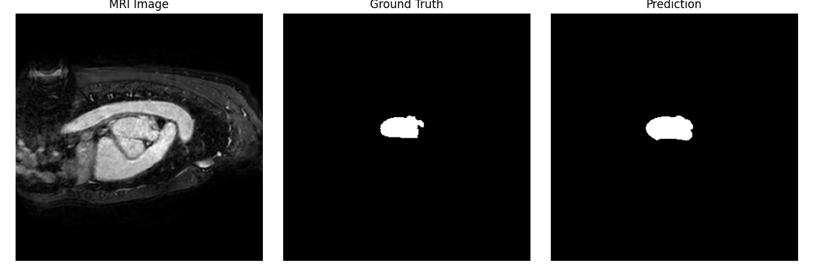
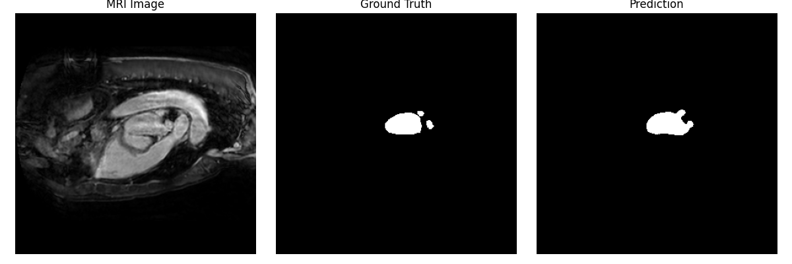
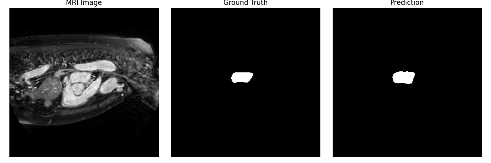
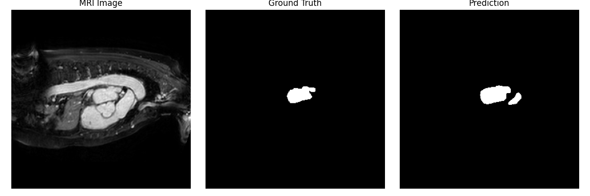
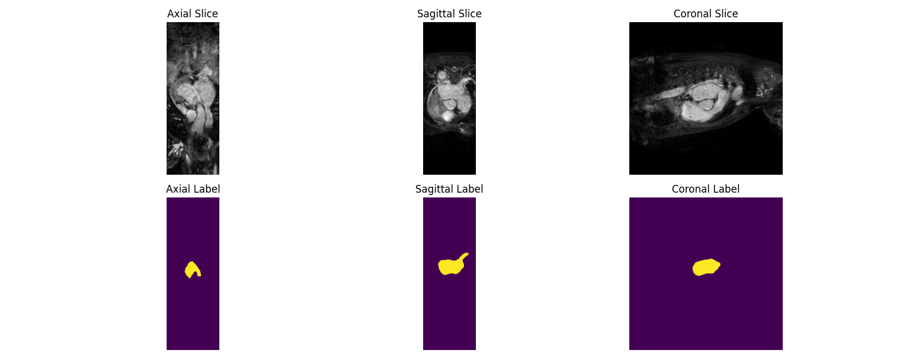
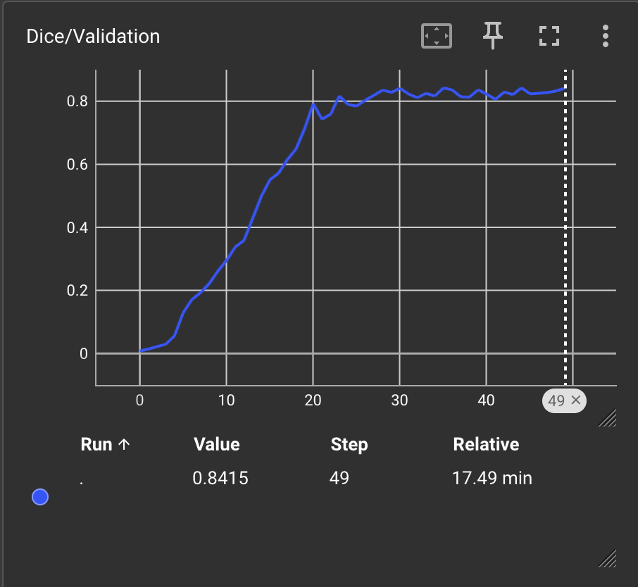
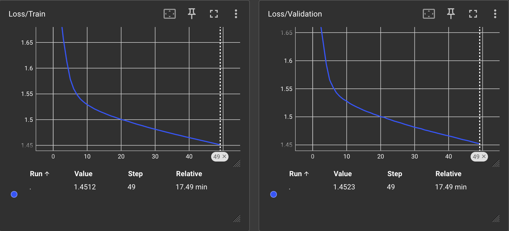

# Homework 10: Report 

## Personal Information
- **Name:** Josh Briley
- **Date:** April 16, 2025
- **Course:** Health Science Meets Data Science
- **Instructor:** Olmo Zavala Romero

### Dataset Access and Loading
The Heart MRI dataset used for this project was provided by the Medical Decathlon challenge and pre-downloaded to the following directory:
```python
data_dir = "/home/osz09/DATA_SharedClasses/SharedDatasets/MedicalDecathlon/Task02_Heart"
```
Each data sample contains a 3D MRI scan and its corresponding segmentation mask of the left atrium in NIfTI format.

To prepare the data:
- Images were normalized using **z-score normalization** (zero mean, unit variance)
- Both images and labels were reshaped to include a **channel dimension** for PyTorch compatibility
- A basic **80/20 train/val split** was implemented

Below is the class used for loading the dataset:
```python
import os
import nibabel as nib
import numpy as np
import torch
from torch.utils.data import Dataset

class HeartMRIDataset(Dataset):
    def __init__(self, data_dir, split='train', transform=None):
        self.image_dir = os.path.join(data_dir, f"imagesTr")
        self.label_dir = os.path.join(data_dir, f"labelsTr")
        self.image_files = sorted([f for f in os.listdir(self.image_dir) if f.endswith(".nii.gz")])
        self.label_files = sorted([f for f in os.listdir(self.label_dir) if f.endswith(".nii.gz")])

        # Basic train/val split
        total = len(self.image_files)
        cutoff = int(0.8 * total)
        if split == 'train':
            self.image_files = self.image_files[:cutoff]
            self.label_files = self.label_files[:cutoff]
        else:
            self.image_files = self.image_files[cutoff:]
            self.label_files = self.label_files[cutoff:]

        self.transform = transform

    def __len__(self):
        return len(self.image_files)

    def __getitem__(self, idx):
        img_path = os.path.join(self.image_dir, self.image_files[idx])
        label_path = os.path.join(self.label_dir, self.label_files[idx])

        image = nib.load(img_path).get_fdata().astype(np.float32)
        label = nib.load(label_path).get_fdata().astype(np.float32)

        # Normalize image (z-score)
        image = (image - np.mean(image)) / (np.std(image) + 1e-8)

        # Add channel dimension
        image = np.expand_dims(image, axis=0)
        label = np.expand_dims(label, axis=0)

        if self.transform:
            image, label = self.transform(image, label)

        return torch.tensor(image), torch.tensor(label)

# Example usage
if __name__ == "__main__":
    dataset = HeartMRIDataset("/home/osz09/DATA_SharedClasses/SharedDatasets/MedicalDecathlon/Task02_Heart")
    print("Dataset size:", len(dataset))
    img, lbl = dataset[0]
    print("Image shape:", img.shape, "Label shape:", lbl.shape)

```

### Model Architecture
The segmentation model is a **3D U-Net** built with PyTorch. Key components include:
- **3D convolutional layers** with `InstanceNorm3d` and ReLU activations
- **3D max pooling** for downsampling
- **Transposed convolutions** for upsampling
- **Skip connections** using padding and concatenation

The architecture was deliberately made lightweight to accommodate limited GPU memory. Channel sizes progress as follows:
```
Encoder: 16 → 32 → 64
Bottleneck: 128
Decoder: 64 → 32 → 16
```

TensorBoard was used to visualize the architecture. The model graph was logged via:
```python
import torch
import torch.nn as nn
from torchsummary import summary
import torch.nn.functional as F

# Padding-based skip connection matching
def match_size_and_concat(upsampled, bypass):
    diff_d = bypass.shape[2] - upsampled.shape[2]
    diff_h = bypass.shape[3] - upsampled.shape[3]
    diff_w = bypass.shape[4] - upsampled.shape[4]

    upsampled = F.pad(upsampled, [
        diff_w // 2, diff_w - diff_w // 2,
        diff_h // 2, diff_h - diff_h // 2,
        diff_d // 2, diff_d - diff_d // 2
    ])

    return torch.cat([upsampled, bypass], dim=1)

class DoubleConv3D(nn.Module):
    def __init__(self, in_channels, out_channels):
        super(DoubleConv3D, self).__init__()
        self.double_conv = nn.Sequential(
            nn.Conv3d(in_channels, out_channels, kernel_size=3, padding=1),
            nn.InstanceNorm3d(out_channels),
            nn.ReLU(inplace=True),
            nn.Conv3d(out_channels, out_channels, kernel_size=3, padding=1),
            nn.InstanceNorm3d(out_channels),
            nn.ReLU(inplace=True)
        )

    def forward(self, x):
        return self.double_conv(x)

class UNet3D(nn.Module):
    def __init__(self, in_channels=1, out_channels=1):
        super(UNet3D, self).__init__()
        self.encoder1 = DoubleConv3D(in_channels, 16)
        self.pool1 = nn.MaxPool3d(2)

        self.encoder2 = DoubleConv3D(16, 32)
        self.pool2 = nn.MaxPool3d(2)

        self.encoder3 = DoubleConv3D(32, 64)
        self.pool3 = nn.MaxPool3d(2)

        self.bottleneck = DoubleConv3D(64, 128)

        self.upconv3 = nn.ConvTranspose3d(128, 64, kernel_size=2, stride=2)
        self.decoder3 = DoubleConv3D(128, 64)

        self.upconv2 = nn.ConvTranspose3d(64, 32, kernel_size=2, stride=2)
        self.decoder2 = DoubleConv3D(64, 32)

        self.upconv1 = nn.ConvTranspose3d(32, 16, kernel_size=2, stride=2)
        self.decoder1 = DoubleConv3D(32, 16)

        self.final_conv = nn.Conv3d(16, out_channels, kernel_size=1)

    def forward(self, x):
        enc1 = self.encoder1(x)
        enc2 = self.encoder2(self.pool1(enc1))
        enc3 = self.encoder3(self.pool2(enc2))

        bottleneck = self.bottleneck(self.pool3(enc3))

        dec3 = self.upconv3(bottleneck)
        dec3 = self.decoder3(match_size_and_concat(dec3, enc3))

        dec2 = self.upconv2(dec3)
        dec2 = self.decoder2(match_size_and_concat(dec2, enc2))

        dec1 = self.upconv1(dec2)
        dec1 = self.decoder1(match_size_and_concat(dec1, enc1))

        return self.final_conv(dec1)

if __name__ == "__main__":
    model = UNet3D(in_channels=1, out_channels=1)
    device = torch.device("cuda" if torch.cuda.is_available() else "cpu")
    model = model.to(device)
    summary(model, (1, 64, 64, 64))

    from torch.utils.tensorboard import SummaryWriter
    dummy_input = torch.randn(1, 1, 64, 64, 64).to(device)
    writer = SummaryWriter("runs/unet3d")
    writer.add_graph(model, dummy_input)
    writer.close()
```

Output:
```----------------------------------------------------------------
        Layer (type)               Output Shape         Param #
================================================================
            Conv3d-1       [-1, 16, 64, 64, 64]             448
    InstanceNorm3d-2       [-1, 16, 64, 64, 64]               0
              ReLU-3       [-1, 16, 64, 64, 64]               0
            Conv3d-4       [-1, 16, 64, 64, 64]           6,928
    InstanceNorm3d-5       [-1, 16, 64, 64, 64]               0
              ReLU-6       [-1, 16, 64, 64, 64]               0
      DoubleConv3D-7       [-1, 16, 64, 64, 64]               0
         MaxPool3d-8       [-1, 16, 32, 32, 32]               0
            Conv3d-9       [-1, 32, 32, 32, 32]          13,856
   InstanceNorm3d-10       [-1, 32, 32, 32, 32]               0
             ReLU-11       [-1, 32, 32, 32, 32]               0
           Conv3d-12       [-1, 32, 32, 32, 32]          27,680
   InstanceNorm3d-13       [-1, 32, 32, 32, 32]               0
             ReLU-14       [-1, 32, 32, 32, 32]               0
     DoubleConv3D-15       [-1, 32, 32, 32, 32]               0
        MaxPool3d-16       [-1, 32, 16, 16, 16]               0
           Conv3d-17       [-1, 64, 16, 16, 16]          55,360
   InstanceNorm3d-18       [-1, 64, 16, 16, 16]               0
             ReLU-19       [-1, 64, 16, 16, 16]               0
           Conv3d-20       [-1, 64, 16, 16, 16]         110,656
   InstanceNorm3d-21       [-1, 64, 16, 16, 16]               0
             ReLU-22       [-1, 64, 16, 16, 16]               0
     DoubleConv3D-23       [-1, 64, 16, 16, 16]               0
        MaxPool3d-24          [-1, 64, 8, 8, 8]               0
           Conv3d-25         [-1, 128, 8, 8, 8]         221,312
   InstanceNorm3d-26         [-1, 128, 8, 8, 8]               0
             ReLU-27         [-1, 128, 8, 8, 8]               0
           Conv3d-28         [-1, 128, 8, 8, 8]         442,496
   InstanceNorm3d-29         [-1, 128, 8, 8, 8]               0
             ReLU-30         [-1, 128, 8, 8, 8]               0
     DoubleConv3D-31         [-1, 128, 8, 8, 8]               0
  ConvTranspose3d-32       [-1, 64, 16, 16, 16]          65,600
           Conv3d-33       [-1, 64, 16, 16, 16]         221,248
   InstanceNorm3d-34       [-1, 64, 16, 16, 16]               0
             ReLU-35       [-1, 64, 16, 16, 16]               0
           Conv3d-36       [-1, 64, 16, 16, 16]         110,656
   InstanceNorm3d-37       [-1, 64, 16, 16, 16]               0
             ReLU-38       [-1, 64, 16, 16, 16]               0
     DoubleConv3D-39       [-1, 64, 16, 16, 16]               0
  ConvTranspose3d-40       [-1, 32, 32, 32, 32]          16,416
           Conv3d-41       [-1, 32, 32, 32, 32]          55,328
   InstanceNorm3d-42       [-1, 32, 32, 32, 32]               0
             ReLU-43       [-1, 32, 32, 32, 32]               0
           Conv3d-44       [-1, 32, 32, 32, 32]          27,680
   InstanceNorm3d-45       [-1, 32, 32, 32, 32]               0
             ReLU-46       [-1, 32, 32, 32, 32]               0
     DoubleConv3D-47       [-1, 32, 32, 32, 32]               0
  ConvTranspose3d-48       [-1, 16, 64, 64, 64]           4,112
           Conv3d-49       [-1, 16, 64, 64, 64]          13,840
   InstanceNorm3d-50       [-1, 16, 64, 64, 64]               0
             ReLU-51       [-1, 16, 64, 64, 64]               0
           Conv3d-52       [-1, 16, 64, 64, 64]           6,928
   InstanceNorm3d-53       [-1, 16, 64, 64, 64]               0
             ReLU-54       [-1, 16, 64, 64, 64]               0
     DoubleConv3D-55       [-1, 16, 64, 64, 64]               0
           Conv3d-56        [-1, 1, 64, 64, 64]              17
================================================================
Total params: 1,400,561
Trainable params: 1,400,561
Non-trainable params: 0
----------------------------------------------------------------
Input size (MB): 1.00
Forward/backward pass size (MB): 640.75
Params size (MB): 5.34
Estimated Total Size (MB): 647.09
----------------------------------------------------------------
```
### Training Implementation 

Training was done using a combination of **Dice loss** and **Binary Cross Entropy loss** to improve stability:
```python
def hybrid_loss(pred, target):
    bce = nn.BCEWithLogitsLoss()(pred, target)
    dsc = dice_loss(pred, target)
    return bce + dsc
```

Training details:
- **Optimizer**: Adam (learning rate: `1e-4`)
- **Loss logged**: Dice + BCE
- **Scheduler**: ReduceLROnPlateau (optional)
- **Early stopping** was disabled for this run
- **Mixed precision** (`autocast + GradScaler`) used for memory efficiency

**TensorBoard Logging:**
- `Loss/Train` and `Loss/Validation`
- `Dice/Validation`
- TensorBoard logs were saved to `runs/heart_mri`

```python
import os
import torch
import torch.nn as nn
import torch.optim as optim
from torch.utils.data import DataLoader
from torch.utils.tensorboard import SummaryWriter
from mymodels import UNet3D
from dataset import HeartMRIDataset  # Assume you define a dataset class elsewhere
import numpy as np
import torch.nn.functional as F

# Dice loss implementation
def dice_loss(pred, target, epsilon=1e-5):
    pred = torch.sigmoid(pred)
    intersection = (pred * target).sum(dim=(2, 3, 4))
    union = pred.sum(dim=(2, 3, 4)) + target.sum(dim=(2, 3, 4))
    dice = (2. * intersection + epsilon) / (union + epsilon)
    return 1 - dice.mean()

# Hybrid loss: BCE + Dice
def hybrid_loss(pred, target):
    bce = nn.BCEWithLogitsLoss()(pred, target)
    dsc = dice_loss(pred, target)
    return bce + dsc

# Match spatial dimensions of skip connections
def match_size_and_concat(upsampled, bypass):
    diff_d = bypass.shape[2] - upsampled.shape[2]
    diff_h = bypass.shape[3] - upsampled.shape[3]
    diff_w = bypass.shape[4] - upsampled.shape[4]

    upsampled = F.pad(upsampled, [
        diff_w // 2, diff_w - diff_w // 2,
        diff_h // 2, diff_h - diff_h // 2,
        diff_d // 2, diff_d - diff_d // 2
    ])

    return torch.cat([upsampled, bypass], dim=1)

import mymodels
mymodels.match_size_and_concat = match_size_and_concat

# Training loop
def train(model, train_loader, val_loader, optimizer, scheduler, num_epochs=50, log_dir="runs/heart_mri"):
    writer = SummaryWriter(log_dir=log_dir)
    device = torch.device("cuda" if torch.cuda.is_available() else "cpu")
    model.to(device)

    scaler = torch.cuda.amp.GradScaler()  # for mixed precision
    best_val_loss = float('inf')
    early_stop_counter = 0
    early_stop_patience = 10

    for epoch in range(num_epochs):
        print(f"Epoch {epoch+1}/{num_epochs}")
        model.train()
        running_loss = 0.0
        optimizer.zero_grad()

        for i, batch in enumerate(train_loader):
            images, masks = batch
            images, masks = images.to(device), masks.to(device)

            with torch.cuda.amp.autocast():  # mixed precision
                outputs = model(images)
                loss = hybrid_loss(outputs, masks)

            scaler.scale(loss).backward()

            if (i + 1) % 2 == 0 or (i + 1) == len(train_loader):
                scaler.step(optimizer)
                scaler.update()
                optimizer.zero_grad()

            running_loss += loss.item()

        train_loss = running_loss / len(train_loader)
        writer.add_scalar("Loss/Train", train_loss, epoch)

        model.eval()
        val_loss = 0.0
        dice_score_total = 0.0
        with torch.no_grad():
            for batch in val_loader:
                images, masks = batch
                images, masks = images.to(device), masks.to(device)
                with torch.cuda.amp.autocast():
                    outputs = model(images)
                    loss = hybrid_loss(outputs, masks)
                val_loss += loss.item()

                # Dice score tracking
                preds = (torch.sigmoid(outputs) > 0.5).float()
                intersection = (preds * masks).sum()
                union = preds.sum() + masks.sum()
                dice_score = (2. * intersection) / (union + 1e-5)
                dice_score_total += dice_score.item()

        val_loss /= len(val_loader)
        avg_dice = dice_score_total / len(val_loader)
        writer.add_scalar("Loss/Validation", val_loss, epoch)
        writer.add_scalar("Dice/Validation", avg_dice, epoch)

        print(f"Epoch {epoch+1}/{num_epochs}, Train Loss: {train_loss:.4f}, Val Loss: {val_loss:.4f}, Dice: {avg_dice:.4f}")

        if val_loss < best_val_loss:
            best_val_loss = val_loss
            torch.save(model.state_dict(), os.path.join(log_dir, "best_model_testing.pth"))
            early_stop_counter = 0
        else:
            early_stop_counter += 1

        # if early_stop_counter >= early_stop_patience:
        #     print("Early stopping triggered.")
        #     break

        if scheduler:
            scheduler.step(val_loss)

        torch.cuda.empty_cache()

    writer.close()

if __name__ == "__main__":
    data_dir = "/home/osz09/DATA_SharedClasses/SharedDatasets/MedicalDecathlon/Task02_Heart"

    train_dataset = HeartMRIDataset(data_dir=data_dir, split='train')
    val_dataset = HeartMRIDataset(data_dir=data_dir, split='val')

    train_loader = DataLoader(train_dataset, batch_size=1, shuffle=True, num_workers=0, pin_memory=True)
    val_loader = DataLoader(val_dataset, batch_size=1, shuffle=False, num_workers=0, pin_memory=True)

    model = UNet3D(in_channels=1, out_channels=1)
    optimizer = optim.Adam(model.parameters(), lr=1e-4)
    scheduler = optim.lr_scheduler.ReduceLROnPlateau(optimizer, mode='min', factor=0.5, patience=3)

    train(model, train_loader, val_loader, optimizer, scheduler, num_epochs=50)
``` 
Output:
```
Average Dice Score on Validation Set: 0.8414
Average Loss on Validation Set: 0.9812
```
### Model Evaluation

Model evaluation was performed using the best checkpoint:
```python
model.load_state_dict(torch.load("runs/heart_mri/best_model.pth"))
```

For each validation image:
- Dice score was computed using sigmoid-thresholded predictions
- Predictions were saved as `.png` slices (`results/sample_X.png`)
- Results were logged in TensorBoard under `runs/heart_mri/eval`

Example visualization code:





```python
import os
import torch
import numpy as np
import matplotlib.pyplot as plt
import nibabel as nib
from torch.utils.data import DataLoader
from torch.utils.tensorboard import SummaryWriter
from mymodels import UNet3D
from dataset import HeartMRIDataset
from training import dice_loss
import torch.nn.functional as F

# Dice coefficient (not loss)
def dice_coef(pred, target, epsilon=1e-5):
    pred = torch.sigmoid(pred)
    pred = (pred > 0.5).float()
    intersection = (pred * target).sum(dim=(2, 3, 4))
    union = pred.sum(dim=(2, 3, 4)) + target.sum(dim=(2, 3, 4))
    dice = (2. * intersection + epsilon) / (union + epsilon)
    return dice.mean().item()

# Visualization function
def visualize_prediction(image, mask, pred, idx=0, writer=None):
    image = image.cpu().numpy()[0, 0, :, :, :]  # remove channel dim
    mask = mask.cpu().numpy()[0, 0, :, :, :]
    pred = (torch.sigmoid(pred) > 0.5).float().cpu().numpy()[0, 0, :, :, :]

    mid_slice = image.shape[2] // 2

    fig, axs = plt.subplots(1, 3, figsize=(12, 4))
    axs[0].imshow(image[:, :, mid_slice], cmap='gray')
    axs[0].set_title('MRI Image')
    axs[1].imshow(mask[:, :, mid_slice], cmap='gray')
    axs[1].set_title('Ground Truth')
    axs[2].imshow(pred[:, :, mid_slice], cmap='gray')
    axs[2].set_title('Prediction')
    for ax in axs:
        ax.axis('off')
    plt.tight_layout()
    plt.savefig(f"results/sample_{idx}.png")
    plt.close()

    if writer:
        img_slice = torch.tensor(image[:, :, mid_slice]).float()
        img_slice = (img_slice - img_slice.min()) / (img_slice.max() - img_slice.min() + 1e-5)
        mask_slice = torch.tensor(mask[:, :, mid_slice]).unsqueeze(0)
        pred_slice = torch.tensor(pred[:, :, mid_slice]).unsqueeze(0)

        writer.add_image(f"Image/{idx}", img_slice.unsqueeze(0), global_step=0)
        writer.add_image(f"Mask/{idx}", mask_slice, global_step=0)
        writer.add_image(f"Prediction/{idx}", pred_slice, global_step=0)

if __name__ == "__main__":
    data_dir = "/home/osz09/DATA_SharedClasses/SharedDatasets/MedicalDecathlon/Task02_Heart"
    val_dataset = HeartMRIDataset(data_dir=data_dir, split='val')
    val_loader = DataLoader(val_dataset, batch_size=1, shuffle=False, num_workers=0, pin_memory=True)

    device = torch.device("cuda" if torch.cuda.is_available() else "cpu")
    model = UNet3D(in_channels=1, out_channels=1)
    model.load_state_dict(torch.load("runs/heart_mri/best_model.pth", map_location=device))
    model.to(device)
    model.eval()

    dice_scores = []
    os.makedirs("results", exist_ok=True)
    writer = SummaryWriter(log_dir="runs/heart_mri/eval")

    # Log model architecture
    sample_input = torch.randn(1, 1, 64, 64, 64).to(device)
    writer.add_graph(model, sample_input)

    total_val_loss = 0.0
    with torch.no_grad():
        for i, batch in enumerate(val_loader):
            image, mask = batch
            image, mask = image.to(device), mask.to(device)
            output = model(image)
            loss = dice_loss(output, mask)
            dice = dice_coef(output, mask)
            dice_scores.append(dice)
            total_val_loss += loss.item()

            writer.add_scalar("DiceScore/val", dice, i)
            writer.add_scalar("Loss/val", loss.item(), i)

            if i < 5:
                visualize_prediction(image, mask, output, idx=i, writer=writer)

    avg_val_dice = np.mean(dice_scores)
    avg_val_loss = total_val_loss / len(val_loader)

    print(f"Average Dice Score on Validation Set: {avg_val_dice:.4f}")
    print(f"Average Loss on Validation Set: {avg_val_loss:.4f}")

    writer.add_scalar("DiceScore/val_avg", avg_val_dice, 0)
    writer.add_scalar("Loss/val_avg", avg_val_loss, 0)
    writer.close()
```
### TensorBoard Logs



### Notes
I had a difficult time getting the tensorboard logs to work properly. For some reason, the logs were not saved correctly and it was only recording over three epochs. Eventually I got this to work. 

Additionally, I had some issues with the model not training properly. I had to adjust the learning rate and the loss function to get it to work properly. There was also some overfitting on the training set, so I had to adjust the model architecture to prevent this.